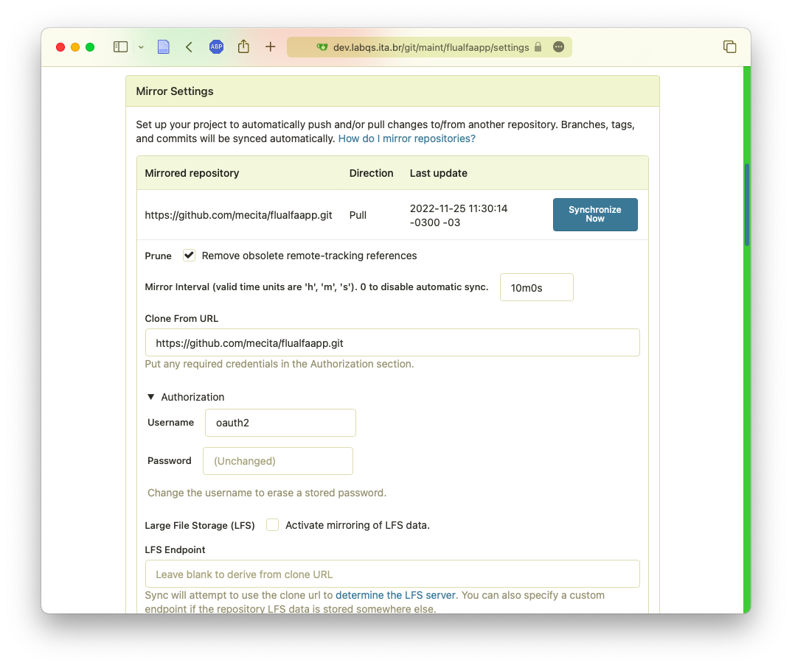
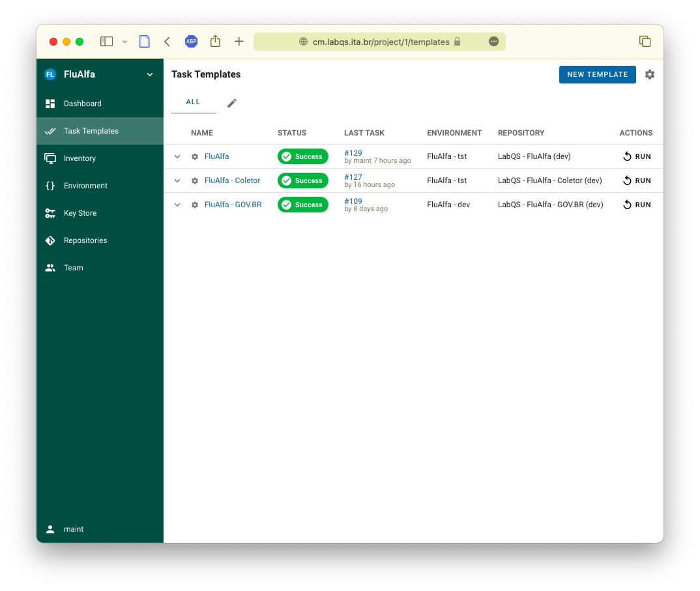
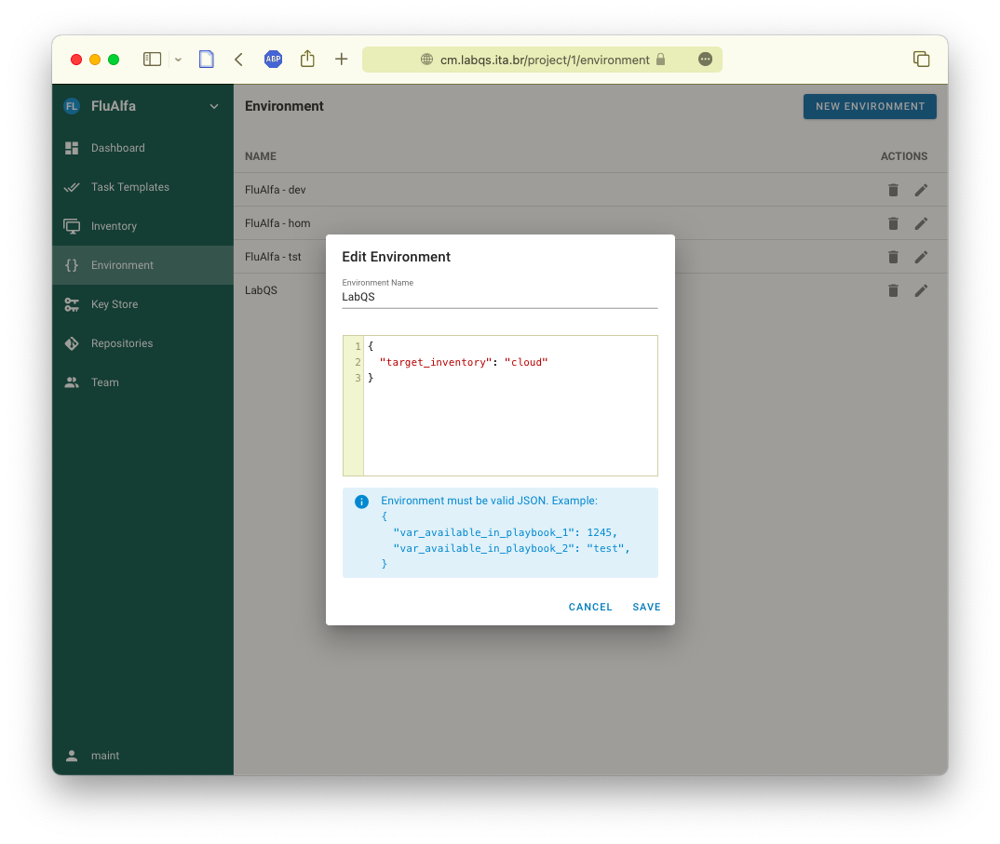
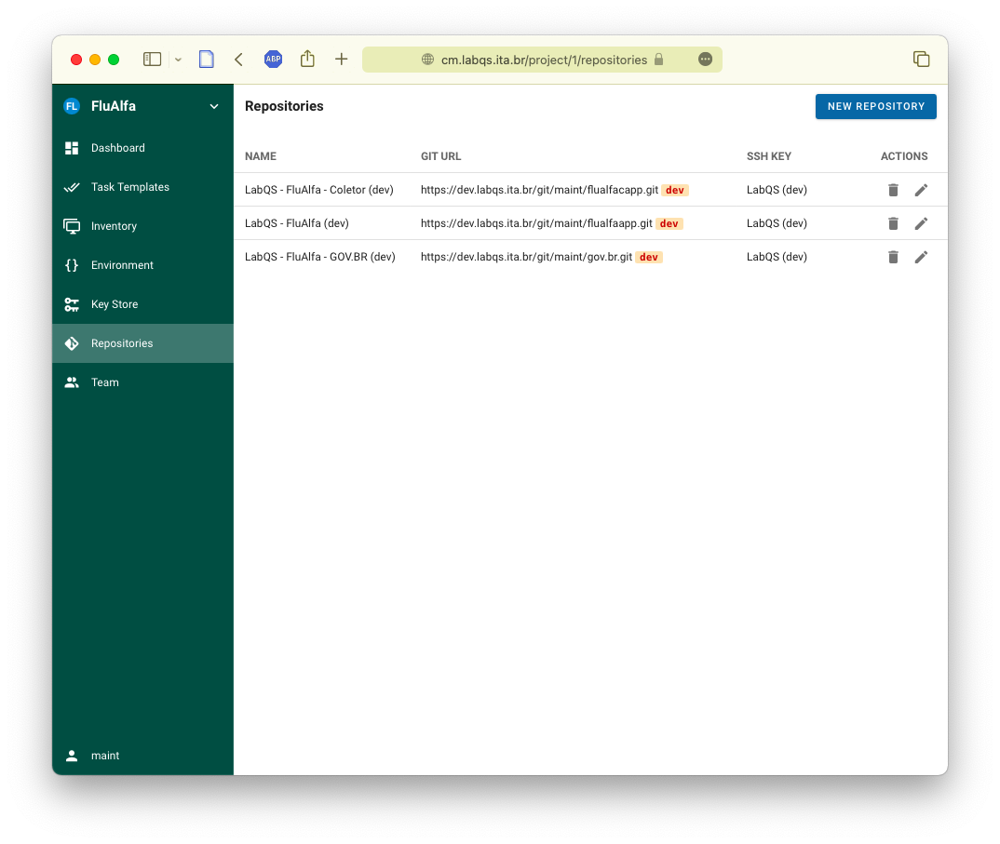
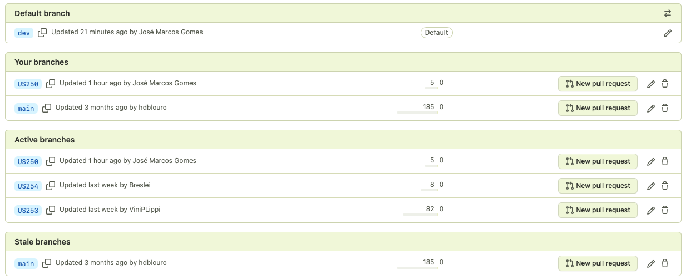
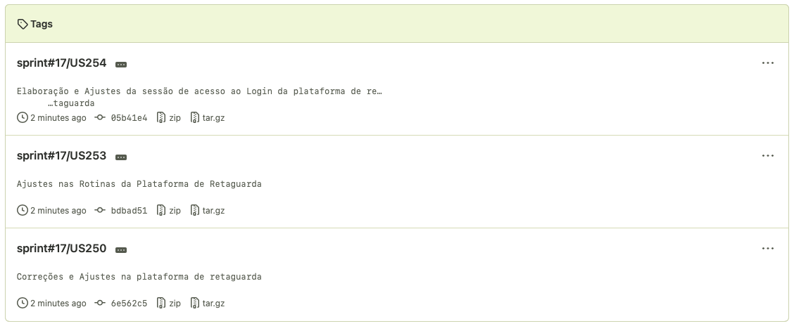

# Instalação da aplicação usando LabQS

## Passos para fazer a instalação da aplicação **FluAlfa** nos servidores do LabQS

### Atualização dos fontes

Após atualizar o repositório de fontes, o **LabQS** faz uma réplica periódica destes mesmos fontes num servidor próprio. Isto é necessário pois estão planejados diversos procedimentos de análise de código fonte e alguns serviços são integrados com um repositório de fontes, o que não seria possível utilizando um externo.

A réplica periódica é automática e ocorre a cada 10 minutos. Caso não deseje esperar a próxima janela de atualização basta executá-la manualmente acessando o repositório [Controle de Fontes _Git_ do **LabQS**](https://dev.labqs.ita.br/git]):



1. Seleção do ambiente:
    * **dev** - ambiente de desenvolvimento e testes dos desenvolvedores
        - testes de integração e automatizados
        - _deployment_ da branch _dev_ ou de alguma branch de desenvolvimento sob demanda
        - atualizado a cada 10 minutos _se houver atualização da branch à qual está associado_
    * **tst** - ambiente de testes e prévia do ambiente de homologação
        - testes funcionais
        - _deployment_ da branch _dev_ ou de alguma _tag_ para reprodução de problemas
        - atualizado diariamente _se houver atualização da branch dev_
    * **hom** - ambiente de homologação
        - validação do usuário e pré-produção
        - _deployment_ da branch _master_
        - atualizado mensalmente no dia 5 

### Execução do procedimento de instalação

Em seguida podemos executar o procedimento de instalação. Este procedimento é comandado pelo arquivo de configuração `.ansible.yml` que se encontra na raiz do projeto:

```yaml
- name: Deploy FluAlfa Docker container
  hosts: '{{target_inventory}}'
  become: yes
  become_user: gpes
  remote_user: gpes

  tasks:
    
    - name: Copy FluAlfa sources
      copy:
        src: .
        dest: /home/gpes/flualfaapp

    - name: Copy configuration file
      command: mv /home/gpes/flualfaapp/.env.{{target_inventory}} /home/gpes/flualfaapp/.env

    - name: Build FluAlfa container
      community.docker.docker_compose:
        project_src: flualfaapp
        env_file: flualfaapp/.env
        build: yes

    - name: Cleanup
      file: 
        path: flualfaapp
        state: absent
```

Podemos observar no arquivo acima que existe o parâmetro `{{target_inventory}}` informando o alvo da instalação e este parâmetro é utilizado para especificar o arquivo de configuração que será utilizado pela aplicação em tempo de execução:

```yaml
    - name: Copy configuration file
      command: mv /home/gpes/flualfaapp/.env.{{target_inventory}} /home/gpes/flualfaapp/.env
```

Sabendo disto devemos observar no [Gerenciamento de Configuração do **LabQS**](https://cm.labqs.ita.br/) na lista de templates as colunas `ENVIRONMENT` e `REPOSITORY` para verificar se correspondem à instalação que desejemos fazer:



Na nomenclatura utilizada temos:

* **FluAlfa** - o projeto
    * **FluAlfa - tst** - o ambiente de testes (**tst**)
    * **LabQS - FluAlfa (dev)** - o _branch_ dev no repositório de fontes

Na lista de ambientes podemos observar a variável `target_inventory` sendo registrada:



Já na lista de repositórios de fontes podemos observar o _branch_ utilizado pelo repositório da tarefa:



## Versionamento

Ao iniciar o desenvolvimento de uma **US**, devemos criar um novo _branch_ a partir do ramo de desenvolvimento e identificá-lo pelo número da **US**:



Quando terminar o desenvolvimento, os seguintes procedimentos serão adotados:

1. Após a reunião de _Sprint Review_, será realizado merge dos branches das **USs** aprovadas;
2. Em seguida estes _branches_ serão rotulados (_tag_) com a identificação da _sprint_;
3. Será feito o _merge_ das _branches_ aprovadas; e
3. Finalmente as **USs** aprovadas serão apagadas.

Para as **USs* não aprovadas ou incompletas podemos:

1. Ter encerramento e exclusão da **US** do repositório; ou
2. A **US** irá prosseguir na _sprint_ seguinte.

Portanto, as **USs** não aprovadoas (ou "ainda" não aprovadas), não serão rotuladas.



> **OBSERVAÇÃO**.: sugerimos a criação de _tags_ com um comentário listando o título resumido da **US** no _Sprint Backlog_:
> ```
> git checkout US250
> git tag sprint#17/US250 -m "Correções e Ajustes na plataforma de retaguarda"
> git checkout US253
> git tag sprint#17/US253 -m "Ajustes nas Rotinas da Plataforma de Retaguarda"
> git checkout US254
> git tag sprint#17/US254 -m "Elaboração e Ajustes da sessão de acesso ao Login da plataforma de retaguarda"
> git tag -n
> sprint#17/US250 Correções e Ajustes na plataforma de retaguarda
> sprint#17/US253 Ajustes nas Rotinas da Plataforma de Retaguarda
> sprint#17/US254 Elaboração e Ajustes da sessão de acesso ao Login da plataforma de retaguarda
> git push --tags
> ```

### Resgatar uma **Tag** em uma nova **Branch**

Para retomar o trabalho numa _tag_ arquivada recomendamos criar uma nova _branch_ a partir da _tag_ desejada, como por exemplo:

```
git checkout -b US999 sprint#88/US777
```

O comando acima irá criar a branch _US999_ a partir da _US777_ da _sprint 88_ que foi arquivada.
