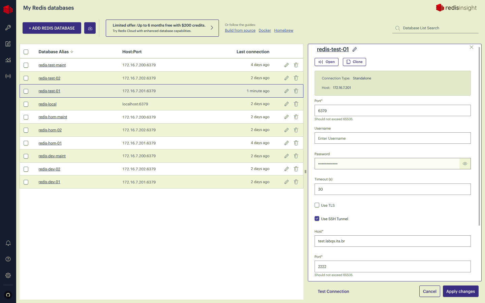
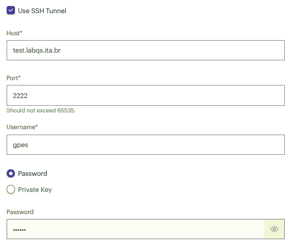

# Acessar REDIS via VPN-ITA usando RedisInsight

Uma vez conectado na VPN-ITA é possível acessar o servidor Redis via túnel SSH com as seguintes configurações:

* **Host**: _`172.16.7.201` (**redis01**) ou `172.16.7.202` (**redis02**)_
* **Username**: _não informar_
* **Password**: _fornecida pelo LabQS_
* **Use SSH Tunnel**: _ligado_
* **Host**: _`test.labqs.ita.br` (ambiente testes) ou `dev.labqs.ita.br` (ambiente de desenvolvimento)_
* **Port**: _`2222`_

Mais abaixo informar seu usuário e senha no servidor _`test.labqs.ita.br`_ ou _`dev.labqs.ita.br`_

